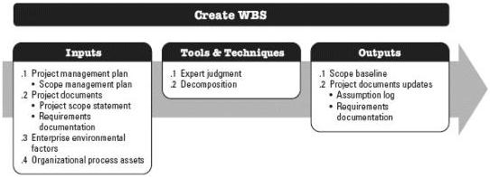
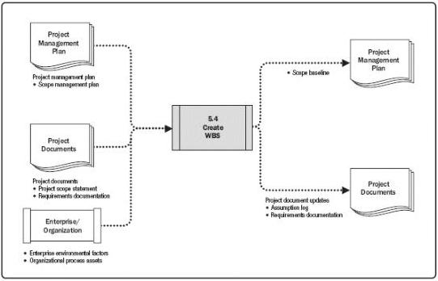

framework of what has to be delivered. This process is performed once or at predefined points in the project. The inputs, tools and techniques, and outputs of this process are depicted in Figure 5-10. Figure 5-11 depicts the data flow diagram of the process.

Figure 5-10. Create WBS: Inputs, Tools & Techniques, and Outputs

Figure 5-11. Create WBS: Data Flow Diagram

The WBS is a hierarchical decomposition of the total scope of work to be carried out by the project team to accomplish the project objectives and create the required deliverables. The WBS organizes and defines the total scope of the project and represents the work specified in the current approved project scope statement.

The planned work is contained within the lowest level of WBS components, which are called work packages. A work package can be used to group the activities where work is scheduled and estimated, monitored, and controlled. In the context of the WBS, work

175