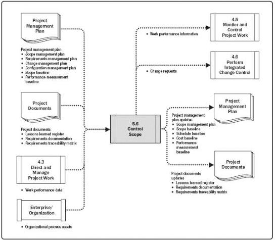

Figure 5-18. Control Scope: Data Flow Diagram

Controlling the project scope ensures all requested changes and recommended corrective or preventive actions are processed through the Perform Integrated Change Control process (see Section 4.6). Control Scope is also used to manage the actual changes when they occur and is integrated with the other control processes. The uncontrolled expansion to product or project scope without adjustments to time, cost, and resources is referred to as scope creep. Change is inevitable; therefore, some type of change control process is mandatory for every project.

## 5.6.1 CONTROL SCOPE: INPUTS

### 5.6.1.1 PROJECT MANAGEMENT PLAN

Described in Section 4.2.3.1. Project management plan components include but are not limited to:

- Scope management plan. Described in Section 5.1.3.1. The scope

187