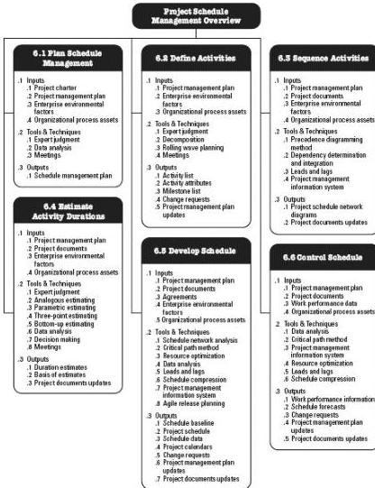

Figure 6-1. Project Schedule Management Overview

## KEY CONCEPTS FOR PROJECT SCHEDULE MANAGEMENT

Project scheduling provides a detailed plan that represents how and when the project will deliver the products, services, and results defined in the project scope and serves as a tool for communication, managing stakeholders’ expectations, and as a basis for performance reporting.

The project management team selects a scheduling method, such as critical path or an agile approach. Then, the project-specific data, such as the activities, planned dates, durations, resources, dependencies, and constraints, are entered into a scheduling tool to create a schedule model for the project. The result is a project schedule. Figure 6-2 provides a scheduling overview that shows how the scheduling method, scheduling tool, and outputs from the Project Schedule Management processes interact to create a schedule model.

193