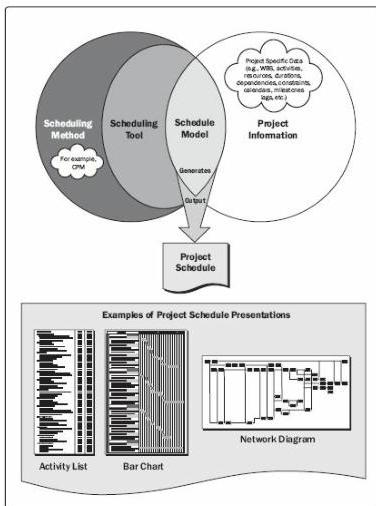

For smaller projects, defining activities, sequencing activities, estimating activity durations, and developing the schedule model are so tightly linked that they are viewed as a single process that can be performed by a person over a relatively short period of time. These processes are presented here as distinct elements because the tools and techniques for each process are different. Some of these processes are presented more fully in the *Practice Standard for Scheduling* [2].

When possible, the detailed project schedule should remain flexible throughout the project to adjust for knowledge gained, increased understanding of the risk, and value-added activities.

Figure 6-2. Scheduling Overview

# TRENDS AND EMERGING PRACTICES IN PROJECT SCHEDULE MANAGEMENT

With high levels of uncertainty and unpredictability in a fast-paced, highly competitive global marketplace where long term scope is difficult to define, it is becoming even more

194