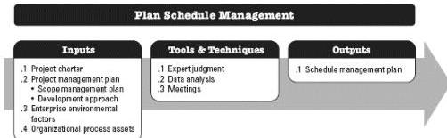
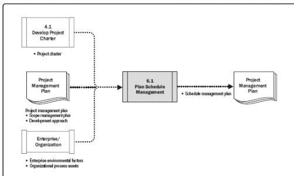

Figure 6-3. Plan Schedule Management: Inputs, Tools & Techniques, and Outputs

Figure 6-4. Plan Schedule Management: Data Flow Diagram

## 6.1.1 PLAN SCHEDULE MANAGEMENT: INPUTS

### 6.1.1.1 PROJECT CHARTER

Described in Section 4.1.3.1. The project charter defines the summary milestone schedule that will influence the management of the project schedule.

### 6.1.1.2 PROJECT MANAGEMENT PLAN

Described in Section 4.3.2.1. Project management plan components include but are not limited to:

- ◆ Scope management plan. Described in Section 5.1.3.1. The scope management plan describes how the scope will be defined and developed, which will provide information on how the schedule will be developed.

197