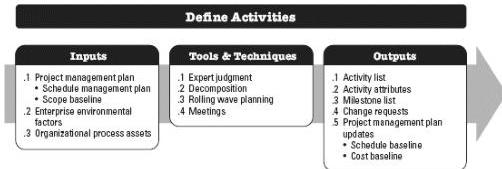
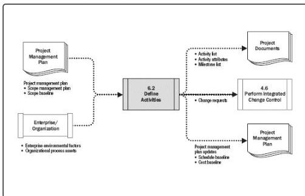

Figure 6-5. Define Activities: Inputs, Tools & Techniques, and Outputs

Figure 6-6. Define Activities: Data Flow Diagram

## 6.2.1 DEFINE ACTIVITIES: INPUTS

### 6.2.1.1 PROJECT MANAGEMENT PLAN

Described in Section 4.2.3.1. Project management plan components include but are not limited to:

- ◆ Schedule management plan. Described in Section 6.1.3.1. The schedule management plan defines the schedule methodology, the duration of waves for rolling wave planning, and the level of detail necessary to manage the work.
- ◆ Scope baseline. Described in Section 5.4.3.1. The project WBS, deliverables, constraints, and assumptions documented in the scope baseline are considered explicitly while defining activities.

201