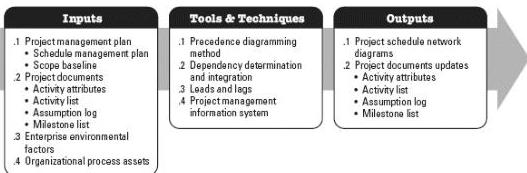
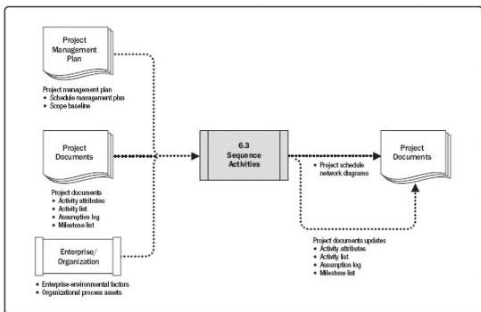

## Sequence Activities

Figure 6-7. Sequence Activities: Inputs, Tools & Techniques, and Outputs

Figure 6-8. Sequence Activities: Data Flow Diagram

Every activity except the first and last should be connected to at least one predecessor and at least one successor activity with an appropriate logical relationship. Logical relationships should be designed to create a realistic project schedule. It may be necessary to use lead or lag time between activities to support a realistic and achievable project schedule. Sequencing can be performed by using project management software or by using manual or automated techniques. The Sequence Activities process concentrates on converting the project activities from a list to a diagram to act as a first step to publish the schedule baseline.

205