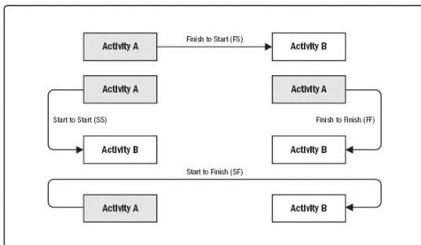

start until a predecessor activity has started. For example, level concrete (successor) cannot begin until pour foundation (predecessor) begins.

- ◆ Start-to-finish (SF). A logical relationship in which a successor activity cannot finish until a predecessor activity has started. For example, a new accounts payable system (successor) has to start before the old accounts payable system can be shut down (predecessor).

In PDM, FS is the most commonly used type of precedence relationship. The SF relationship is very rarely used, but is included to present a complete list of the PDM relationship types.

Two activities can have two logical relationships at the same time (for example, SS and FF). Multiple relationships between the same activities are not recommended, so a decision has to be made to select the relationship with the highest impact. Closed loops are also not recommended in logical relationships.

Figure 6-9. Precedence Diagramming Method (PDM) Relationship Types

### 6.3.2.2 DEPENDENCY DETERMINATION AND INTEGRATION

Dependencies may be characterized by the following attributes: mandatory or discretionary, internal or external (as described below). Dependency has four attributes, but two can be applicable at the same time in the following ways: mandatory external dependencies, mandatory internal dependencies, discretionary external dependencies, or discretionary internal dependencies.

- ◆ Mandatory dependencies. Mandatory dependencies are those that are legally or contractually required or inherent in the nature of the work. Mandatory

208