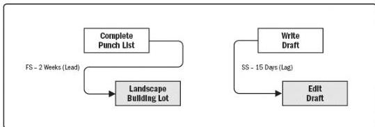

A lead is the amount of time a successor activity can be advanced with respect to a predecessor activity. For example, on a project to construct a new office building, the landscaping could be scheduled to start 2 weeks prior to the scheduled punch list completion. This would be shown as a finish-to-start with a 2-week lead as shown in Figure 6-10. Lead is often represented as a negative value for lag in scheduling software.

Figure 6-10. Examples of Lead and Lag

A lag is the amount of time a successor activity will be delayed with respect to a predecessor activity. For example, a technical writing team may begin editing the draft of a large document 15 days after they begin writing it. This can be shown as a start-to-start relationship with a 15-day lag as shown in Figure 6-10. Lag can also be represented in project schedule network diagrams as shown in Figure 6-11 in the relationship between activities H and I (as indicated by the nomenclature SS+10 (start-to-start plus 10 days lag) even though the offset is not shown relative to a timescale).

The project management team determines the dependencies that may require a lead or a lag to accurately define the logical relationship. The use of leads and lags should not replace schedule logic. Also, duration estimates do not include any leads or lags. Activities and their related assumptions should be documented.

210