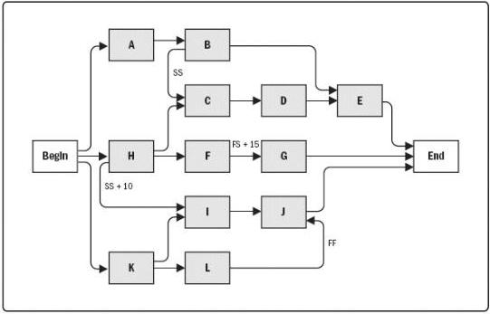

Figure 6-11. Project Schedule Network Diagram

### 6.3.2.4 PROJECT MANAGEMENT INFORMATION SYSTEM (PMIS)

Described in Section 4.3.2.2. Project management information systems includes scheduling software that has the capability to help plan, organize, and adjust the sequence of the activities; insert the logical relationships, lead and lag values; and differentiate the different types of dependencies.

### 6.3.3 SEQUENCE ACTIVITIES: OUTPUTS

#### 6.3.3.1 PROJECT SCHEDULE NETWORK DIAGRAMS

A project schedule network diagram is a graphical representation of the logical relationships, also referred to as dependencies, among the project schedule activities. Figure 6-11 illustrates a project schedule network diagram. A project schedule network diagram is produced manually or by using project management software. It can include full project details, or have one or more summary activities. A summary narrative can accompany the diagram and describe the basic approach used to sequence the activities. Any unusual activity sequences within the network should be fully described within the narrative.

Activities that have multiple predecessor activities indicate a path convergence. Activities that have multiple successor activities indicate a path divergence. Activities with divergence and convergence are at greater risk as they are affected by multiple activities or can affect multiple activities. Activity I is called a path convergence, as it has more than one

211