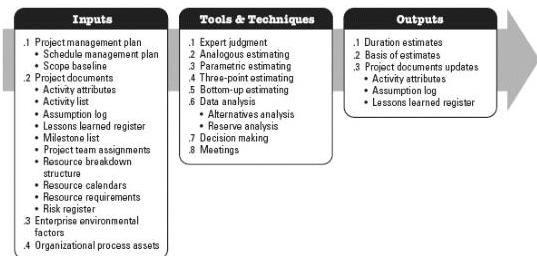
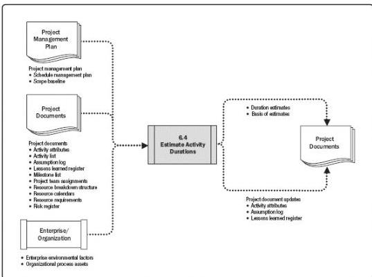

## Estimate Activity Durations

Figure 6-12. Estimate Activity Durations: Inputs, Tools & Techniques, and Outputs

Figure 6-13. Estimate Activity Durations: Data Flow Diagram

Estimating activity durations uses information from the scope of work, required resource types or skill levels, estimated resource quantities, and resource calendars. Other factors that may influence the duration estimates include constraints imposed on the duration, effort

213