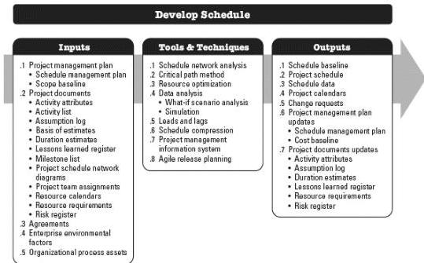

but are not limited to:

- ◆ Activity attributes. Described in Section 6.2.3.2. Activity duration estimates produced during this process are documented as part of the activity attributes.
- ◆ Assumption log. Described in Section 4.1.3.2. This includes assumptions made in developing the duration estimate, such as resource skill levels and availability, as well as a basis of estimates for durations. Additionally, constraints arising out of the scheduling methodology and scheduling tool are also documented.
- ◆ Lessons learned register. Described in Section 4.4.3.1. The lessons learned register can be updated with techniques that were efficient and effective in developing effort and duration estimates.

## 6.5 DEVELOP SCHEDULE

Develop Schedule is the process of analyzing activity sequences, durations, resource requirements, and schedule constraints to create a schedule model for project execution and monitoring and controlling. The key benefit of this process is that it generates a schedule model with planned dates for completing project activities. This process is performed throughout the project. The inputs, tools and techniques, and outputs of this process are depicted in Figure 6-14. Figure 6-15 depicts the data flow diagram of the process.

Figure 6-14. Develop Schedule: Inputs, Tools & Techniques, and Outputs

221