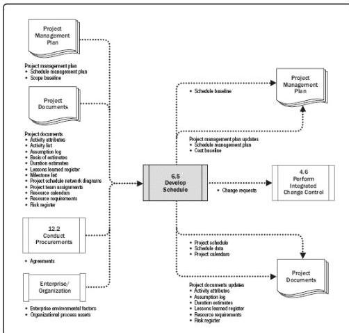

Figure 6-15. Develop Schedule: Data Flow Diagram

Developing an acceptable project schedule is an iterative process. The schedule model is used to determine the planned start and finish dates for project activities and milestones based on the best available information. Schedule development can require the review and revision of duration estimates, resource estimates, and schedule reserves to establish an approved project schedule that can serve as a baseline to track progress. Key steps include defining the project milestones, identifying and sequencing activities, and estimating durations. Once the activity start and finish dates have been determined, it is common to have the project staff assigned to the activities review their assigned activities. The staff confirms that the start and finish dates present no conflict with resource calendars or assigned activities on other projects or tasks and thus are still valid. The schedule is then analyzed to determine conflicts with logical relationships and if resource leveling is required before the schedule is approved and baselined. Revising and maintaining the project schedule model to sustain a realistic schedule continues throughout the duration of the project, as described in Section 6.7.

For more specific information regarding scheduling, refer to the Practice Standard for Scheduling.

222