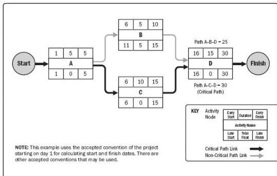

on track. Schedule networks may have multiple near-critical paths. Many software packages allow the user to define the parameters used to determine the critical path(s). Adjustments to activity durations (when more resources or less scope can be arranged), logical relationships (when the relationships were discretionary to begin with), leads and lags, or other schedule constraints may be necessary to produce network paths with a zero or positive total float. Once the total float and the free float have been calculated, the free float is the amount of time that a schedule activity can be delayed without delaying the early start date of any successor or violating a schedule constraint. For example the free float for Activity B, in Figure 6-16, is 5 days.

Figure 6-16. Example of Critical Path Method

### 6.5.2.3 RESOURCE OPTIMIZATION

Resource optimization is used to adjust the start and finish dates of activities to adjust planned resource use to be equal to or less than resource availability. Examples of resource optimization techniques that can be used to adjust the schedule model due to demand and supply of resources include but are not limited to:

- ◆ Resource leveling. A technique in which start and finish dates are adjusted based on resource constraints with the goal of balancing the demand for resources with the available supply. Resource leveling can be used when shared or critically required resources are available only at certain times or in limited quantities, or are over-allocated, such as when a resource has been assigned to two or more activities during the same time period (as shown in Figure 6-17),

226