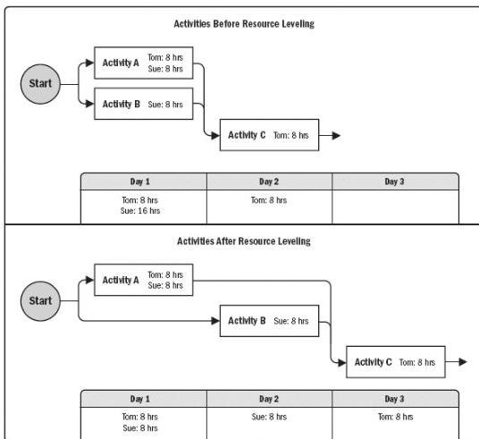

or there is a need to keep resource usage at a constant level. Resource leveling can often cause the original critical path to change. Available float is used for leveling resources. Consequently, the critical path through the project schedule may change.

- ◆ Resource smoothing. A technique that adjusts the activities of a schedule model such that the requirements for resources on the project do not exceed certain predefined resource limits. In resource smoothing, as opposed to resource leveling, the project's critical path is not changed and the completion date may not be delayed. In other words, activities may only be delayed within their free and total float. Resource smoothing may not be able to optimize all resources.

Figure 6-17. Resource Leveling

#### 6.5.2.4 DATA ANALYSIS

Data analysis techniques that can be used for this process include but are not limited to:

227