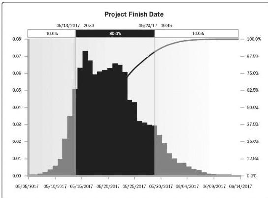

Figure 6-18. Example Probability Distribution of a Target Milestone

For more information on how Monte Carlo simulation is used for schedule models, see the Practice Standard for Scheduling.

6.5.2.5 LEADS AND LAGS

Described in Section 6.3.2.3. Leads and lags are refinements applied during network analysis to develop a viable schedule by adjusting the start time of the successor activities. Leads are used in limited circumstances to advance a successor activity with respect to the predecessor activity, and lags are used in limited circumstances where processes require a set period of time to elapse between the predecessors and successors without work or resource impact.

6.5.2.6 SCHEDULE COMPRESSION

Schedule compression techniques are used to shorten or accelerate the schedule duration without reducing the project scope in order to meet schedule constraints, imposed dates, or other schedule objectives. A helpful technique is the negative float analysis. The critical path is the one with the least float. Due to violating a constraint or imposed date, the total float can become negative. Schedule compression techniques are compared in Figure 6-19 and include:

229