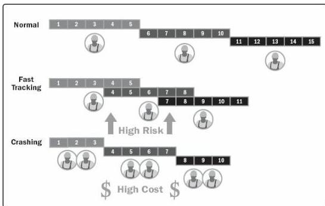

◆ Crashing. A technique used to shorten the schedule duration for the least incremental cost by adding resources. Examples of crashing include approving overtime, bringing in additional resources, or paying to expedite delivery to activities on the critical path. Crashing works only for activities on the critical path where additional resources will shorten the activity's duration. Crashing does not always produce a viable alternative and may result in increased risk and/or cost.

◆ Fast tracking. A schedule compression technique in which activities or phases normally done in sequence are performed in parallel for at least a portion of their duration. An example is constructing the foundation for a building before completing all of the architectural drawings. Fast tracking may result in rework and increased risk. Fast tracking only works when activities can be overlapped to shorten the project duration on the critical path. Using leads in case of schedule acceleration usually increases coordination efforts between the activities concerned and increases quality risk. Fast tracking may also increase project costs.

Figure 6-19. Schedule Compression Comparison

# 6.5.2.7 PROJECT MANAGEMENT INFORMATION SYSTEM (PMIS)

Described in Section 4.3.2.2. Project management information systems include scheduling software that expedites the process of building a schedule model by generating start and finish dates based on the inputs of activities, network diagrams, resources, and

230