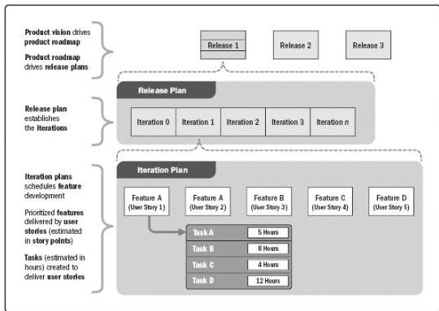

activity durations.

### 6.5.2.8 AGILE RELEASE PLANNING

Agile release planning provides a high-level summary timeline of the release schedule (typically 3 to 6 months) based on the product roadmap and the product vision for the product's evolution. Agile release planning also determines the number of iterations or sprints in the release, and allows the product owner and team to decide how much needs to be developed and how long it will take to have a releasable product based on business goals, dependencies, and impediments.

Since features represent value to the customer, the timeline provides a more easily understood project schedule as it defines which feature will be available at the end of each iteration, which is exactly the depth of information the customer is looking for.

Figure 6-20 shows the relationship among product vision, product roadmap, release planning, and iteration planning.

Figure 6-20. Relationship Between Product Vision, Release Planning, and Iteration Planning

### 6.5.3 DEVELOP SCHEDULE: OUTPUTS

#### 6.5.3.1 SCHEDULE BASELINE

231