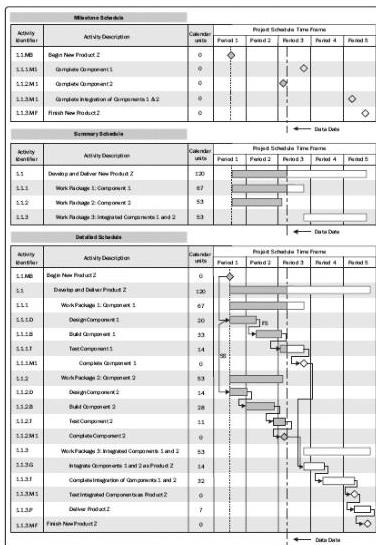

example also shows how each work package is planned as a series of related activities. Another presentation of the project schedule network diagram is a time-scaled logic diagram. These diagrams include a time scale and bars that represent the duration of activities with the logical relationships. They are optimized to show the relationships between activities where any number of activities may appear on the same line of the diagram in sequence.

Figure 6-21 shows schedule presentations for a sample project being executed, with the work in progress reported through as-of date or status date. For a simple project schedule model, Figure 6-21 reflects schedule presentations in the forms of (1) a milestone schedule as a milestone chart, (2) a summary schedule as a bar chart, and (3) a detailed schedule as a project schedule linked bar chart diagram. Figure 6-21 also visually shows the relationships among the different levels of detail of the project schedule.

Figure 6-21. Project Schedule Presentations—Examples

233