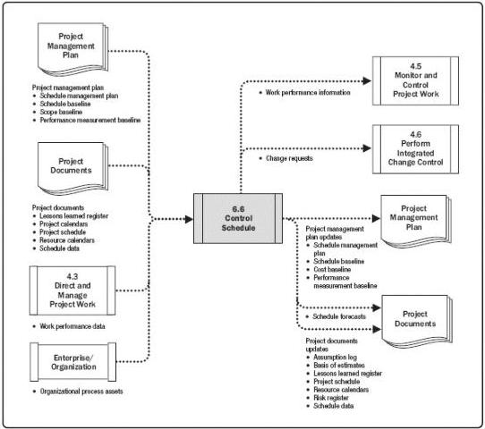

Figure 6-23. Control Schedule: Data Flow Diagram

Updating the schedule model requires knowing the actual performance to date. Any change to the schedule baseline can only be approved through the Perform Integrated Change Control process (Section 4.6). Control Schedule, as a component of the Perform Integrated Change Control process, is concerned with:

- Determining the current status of the project schedule,
- Influencing the factors that create schedule changes,
- Reconsidering necessary schedule reserves,
- Determining if the project schedule has changed, and
- Managing the actual changes as they occur.

When an agile approach is used, Control Schedule is concerned with:

- Determining the current status of the project schedule by comparing the total amount of work delivered and accepted against the estimates of work completed for the elapsed time cycle;

237