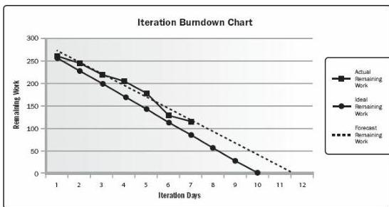

respect to an ideal burndown based on the work committed from iteration planning (see Section 6.4.2.8). A forecast trend line can be used to predict the likely variance at iteration completion and take appropriate actions during the course of the iteration. A diagonal line representing the ideal burndown and daily actual remaining work is then plotted. A trend line is then calculated to forecast completion based on remaining work. Figure 6-24 is an example of an iteration burndown chart.

Figure 6-24. Iteration Burndown Chart

- ◆ Performance reviews. Performance reviews measure, compare, and analyze schedule performance against the schedule baseline such as actual start and finish dates, percent complete, and remaining duration for work in progress.
- ◆ Trend analysis. Described in Section 4.5.2.2. Trend analysis examines project performance over time to determine whether performance is improving or deteriorating. Graphical analysis techniques are valuable for understanding performance to date and for comparing to future performance goals in the form of completion dates.
- ◆ Variance analysis. Variance analysis looks at variances in planned versus actual start and finish dates, planned versus actual durations, and variances in float. Part of variance analysis is determining the cause and degree of variance relative to the schedule baseline (see Section 6.5.3.1), estimating the implications of those variances for future work to completion, and deciding whether corrective or preventive action is required. For example, a major delay on any activity not on the critical path may have little effect on the overall project schedule, while a much shorter delay on a critical or near-critical activity may require immediate action.

240