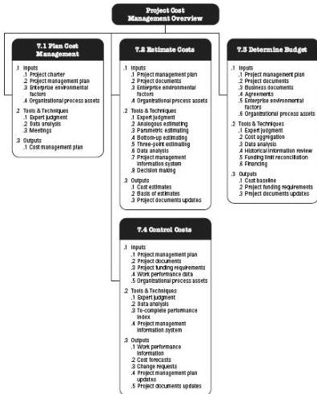

Figure 7-1. Project Cost Management Overview

## KEY CONCEPTS FOR PROJECT COST MANAGEMENT

Project Cost Management is primarily concerned with the cost of the resources needed to complete project activities. Project Cost Management should consider the effect of project decisions on the subsequent recurring cost of using, maintaining, and supporting the product, service, or result of the project. For example, limiting the number of design reviews can reduce the cost of the project but could increase the resulting product's operating costs.

Another aspect of cost management is recognizing that different stakeholders measure project costs in different ways and at different times. For example, the cost of an acquired item may be measured when the acquisition decision is made or committed, the order is placed, the item is delivered, or the actual cost is incurred or recorded for project accounting purposes. In many organizations, predicting and analyzing the prospective financial performance of the project's product is performed outside of the project. In others, such as a capital facilities project, Project Cost Management can include this work.

245