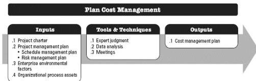
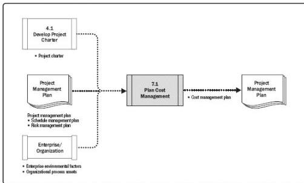

labor costs, which can then be easily adjusted as changes arise. Detailed estimates are reserved for short-term planning horizons in a just-in-time fashion.

In cases where high-variability projects are also subject to strict budgets, the scope and schedule are more often adjusted to stay within cost constraints.

## 7.1 PLAN COST MANAGEMENT

Plan Cost Management is the process of defining how the project costs will be estimated, budgeted, managed, monitored, and controlled. The key benefit of this process is that it provides guidance and direction on how the project costs will be managed throughout the project. This process is performed once or at predefined points in the project. The inputs, tools and techniques, and outputs of this process are depicted in Figure 7-2. Figure 7-3 depicts the data flow diagram of the process.

Figure 7-2. Plan Cost Management: Inputs, Tools & Techniques, and Outputs

Figure 7-3. Plan Cost Management: Data Flow Diagram

The cost management planning effort occurs early in project planning and sets the

247