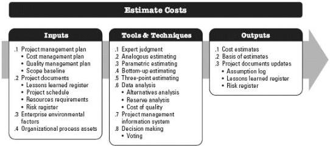

- Establish the EVM techniques (e.g., weighted milestones, fixed-formula, percent complete, etc.) to be employed; and
- Specify tracking methodologies and the EVM computation equations for calculating projected estimate at completion (EAC) forecasts to provide a validity check on the bottom-up EAC.
- Reporting formats. The formats and frequency for the various cost reports are defined.
- Additional details. Additional details about cost management activities include but are not limited to:
  - Description of strategic funding choices,
  - Procedure to account for fluctuations in currency exchange rates, and
  - Procedure for project cost recording.

For more specific information regarding earned value management, refer to the *Practice Standard for Earned Value Management – Second Edition* [17].

## 7.2 ESTIMATE COSTS

Estimate Costs is the process of developing an approximation of the cost of resources needed to complete project work. The key benefit of this process is that it determines the monetary resources required for the project. This process is performed periodically throughout the project as needed. The inputs, tools and techniques, and outputs of this process are depicted in Figure 7-4. Figure 7-5 depicts the data flow diagram of the process.

Figure 7-4. Estimate Costs: Inputs, Tools & Techniques, and Outputs

251