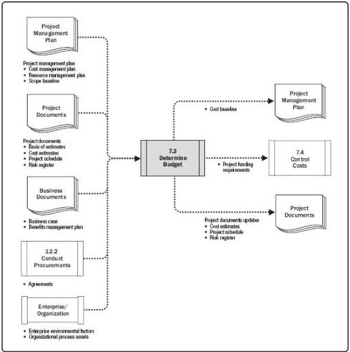

Figure 7-7. Determine Budget: Data Flow Diagram

## 7.3.1 DETERMINE BUDGET: INPUTS

### 7.3.1.1 PROJECT MANAGEMENT PLAN

Described in Section 4.2.3.1. Project management plan components include but are not limited to:

- Cost management plan. Described in Section 7.1.3.1. The cost management plan describes how the project costs will be structured into the project budget.
- Resource management plan. Described in Section 9.1.3.1. The resource management plan provides information on rates (personnel and other resources), estimation of travel costs, and other foreseen costs that are necessary to estimate the overall project budget.

260