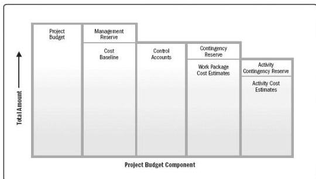

any management reserves, which can only be changed through formal change control procedures. It is used as a basis for comparison to actual results. The cost baseline is developed as a summation of the approved budgets for the different schedule activities.

Figure 7-8 illustrates the various components of the project budget and cost baseline. Cost estimates for the various project activities, along with any contingency reserves (see Section 7.2.2.6) for these activities, are aggregated into their associated work package costs. The work package cost estimates, along with any contingency reserves estimated for the work packages, are aggregated into control accounts. The summation of the control accounts make up the cost baseline. Since the cost estimates that make up the cost baseline are directly tied to the schedule activities, this enables a time-phased view of the cost baseline, which is typically displayed in the form of an S-curve, as is illustrated in Figure 7-9. For projects that use earned value management, the cost baseline is referred to as the performance measurement baseline.

Management reserves (Section 7.2.2.3) are added to the cost baseline to produce the project budget. As changes warranting the use of management reserves arise, the change control process is used to obtain approval to move the applicable management reserve funds into the cost baseline.

Figure 7-8. Project Budget Components

264