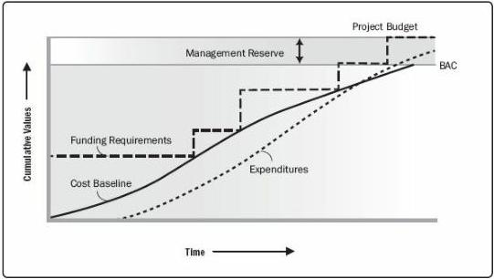

Figure 7-9. Cost Baseline, Expenditures, and Funding Requirements

### 7.3.3.2 PROJECT FUNDING REQUIREMENTS

Total funding requirements and periodic funding requirements (e.g., quarterly, annually) are derived from the cost baseline. The cost baseline will include projected expenditures plus anticipated liabilities. Funding often occurs in incremental amounts, and may not be evenly distributed, which appear as steps in Figure 7-9. The total funds required are those included in the cost baseline plus management reserves, if any. Funding requirements may include the source(s) of the funding.

### 7.3.3.3 PROJECT DOCUMENTS UPDATES

Project documents that may be updated as a result of carrying out this process include but are not limited to:

- Cost estimates. Described in Section 7.2.3.1. Cost estimates are updated to record any additional information.
- Project schedule. Described in Section 6.5.3.2. Estimated costs for each activity may be recorded as part of the project schedule.
- Risk register. Described in Section 11.2.3.1. New risks identified during this process are recorded in the risk register and managed using the risk management processes.

### 7.4 CONTROL COSTS

265