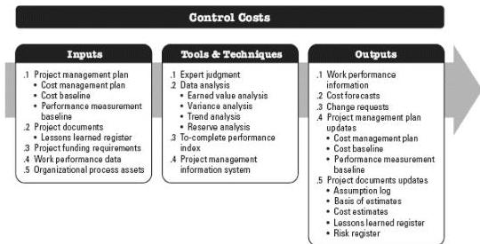

Control Costs is the process of monitoring the status of the project to update the project costs and managing changes to the cost baseline. The key benefit of this process is that the cost baseline is maintained throughout the project. This process is performed throughout the project. The inputs, tools and techniques, and outputs of this process are depicted in Figure 7-10. Figure 7-11 depicts the data flow diagram of the process.

Figure 7-10. Control Costs: Inputs, Tools & Techniques, and Outputs

266