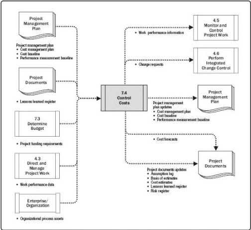

Figure 7-11. Control Costs: Data Flow Diagram

Updating the budget requires knowledge of the actual costs spent to date. Any increase to the authorized budget can only be approved through the Perform Integrated Change Control process (Section 4.6). Monitoring the expenditure of funds without regard to the value of work being accomplished for such expenditures has little value to the project, other than to track the outflow of funds. Much of the effort of cost control involves analyzing the relationship between the consumption of project funds and the work being accomplished for such expenditures. The key to effective cost control is the management of the approved cost baseline.

Project cost control includes:

\(\spadesuit\) Influencing the factors that create changes to the authorized cost baseline;
\(\spadesuit\) Ensuring that all change requests are acted on in a timely manner;
\(\spadesuit\) Managing the actual changes when and as they occur;
\(\spadesuit\) Ensuring that cost expenditures do not exceed the authorized funding by period, by WBS component, by activity, and in total for the project;

267