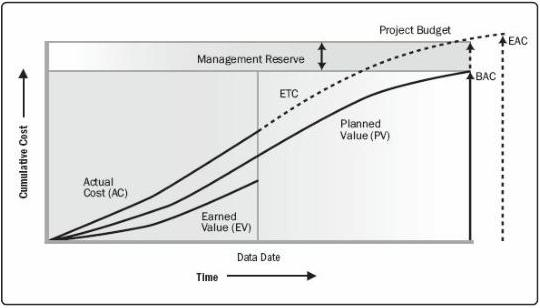

budget and behind the schedule.

Figure 7-12. Earned Value, Planned Value, and Actual Costs

- *Forecasting*. As the project progresses, the project team may develop a forecast for the estimate at completion (EAC) that may differ from the budget at completion (BAC) based on the project performance. If it becomes obvious that the BAC is no longer viable, the project manager should consider the forecasted EAC. Forecasting the EAC involves making projections of conditions and events in the project's future based on current performance information and other knowledge available at the time of the forecast. Forecasts are generated, updated, and reissued based on work performance data (Section 4.3.3.2) that is provided as the project is executed. The work performance information covers the project's past performance and any information that could impact the project in the future.

EACs are typically based on the actual costs incurred for work completed, plus an estimate to complete (ETC) the remaining work. It is incumbent on the project team to predict what it may encounter to perform the ETC, based on its experience to date. Earned value analysis works well in conjunction with manual forecasts of the required EAC costs. The most common EAC forecasting approach is a manual, bottom-up summation by the project manager and project team.

The project manager's bottom-up EAC method builds upon the actual costs and experience incurred for the work completed, and requires a new estimate to complete the remaining project work. Equation: $$\mathrm{EAC} = \mathrm{AC} + \text{Bottom-up ETC}$$.

The project manager's manual EAC is quickly compared with a range of

272