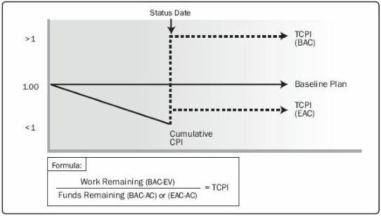

Figure 7-13. To-Complete Performance Index (TCPI)

## 7.4.2.4 PROJECT MANAGEMENT INFORMATION SYSTEM (PMIS)

Described in Section 4.3.2.2. Project management information systems are often used to monitor the three EVM dimensions (PV, EV, and AC), to display graphical trends, and to forecast a range of possible final project results.

## 7.4.3 CONTROL COSTS: OUTPUTS

### 7.4.3.1 WORK PERFORMANCE INFORMATION

Described in Section 4.5.1.3. Work performance information includes information on how the project work is performing compared to the cost baseline. Variances in the work performed and the cost of the work are evaluated at the work package level and control account level. For projects using earned value analysis, CV, CPI, EAC, VAC, and TCPI are documented for inclusion in work performance reports (Section 4.5.3.1).

### 7.4.3.2 COST FORECASTS

Either a calculated EAC value or a bottom-up EAC value is documented and communicated to stakeholders.

### 7.4.3.3 CHANGE REQUESTS

Described in Section 4.3.3.4. Analysis of project performance may result in a change request to the cost and schedule baselines or other components of the project management

276