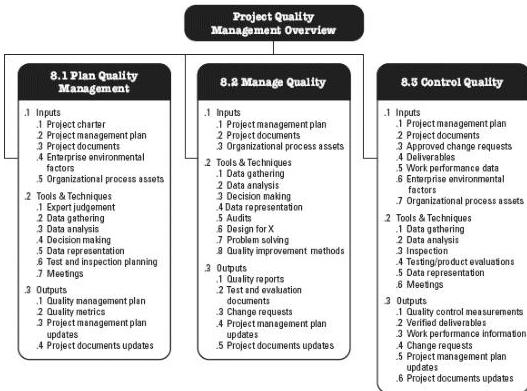

Figure 8-1. Project Quality Management Overview

Figure 8-2 provides an overview of the major inputs and outputs of the Project Quality Management processes and the interrelations of these processes in the Project Quality Management Knowledge Area. The Plan Quality Management process is concerned with the quality that the work needs to have. Manage Quality is concerned with managing the quality processes throughout the project. During the Manage Quality process, quality requirements identified during the Plan Quality Management process are turned into test and evaluation instruments, which are then applied during the Control Quality process to verify these quality requirements are met by the project. Control Quality is concerned with comparing the work results with the quality requirements to ensure the result is acceptable. There are two outputs specific to the Project Quality Management Knowledge Area that are used by other Knowledge Areas: verified deliverables and quality reports.

280