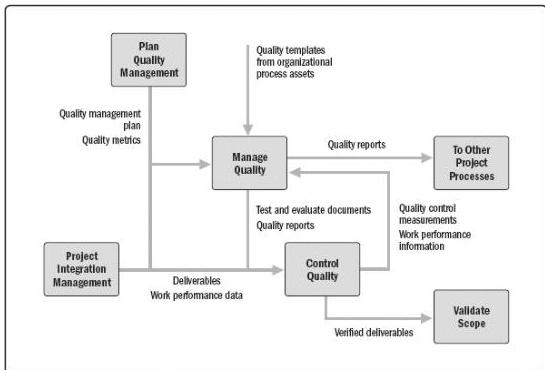

Figure 8-2. Major Project Quality Management Process Interrelations

## KEY CONCEPTS FOR PROJECT QUALITY MANAGEMENT

Project Quality Management addresses the management of the project and the deliverables of the project. It applies to all projects, regardless of the nature of their deliverables. Quality measures and techniques are specific to the type of deliverables being produced by the project. For example, the project quality management of software deliverables may use different approaches and measures from those used when building a nuclear power plant. In either case, failure to meet the quality requirements can have serious negative consequences for any or all of the project's stakeholders. For example:

- ◆ Meeting customer requirements by overworking the project team may result in decreased profits and increased levels of overall project risks, employee attrition, errors, or rework.
- ◆ Meeting project schedule objectives by rushing planned quality inspections may result in undetected errors, decreased profits, and increased post-implementation risks.

*Quality* and *grade* are not the same concepts. Quality as a delivered performance or result is "the degree to which a set of inherent characteristics fulfill requirements" (ISO 9000 [18]). Grade as a design intent is a category assigned to deliverables having the same functional use but different technical characteristics. The project manager and the project management team are responsible for managing the trade-offs associated with delivering the

281