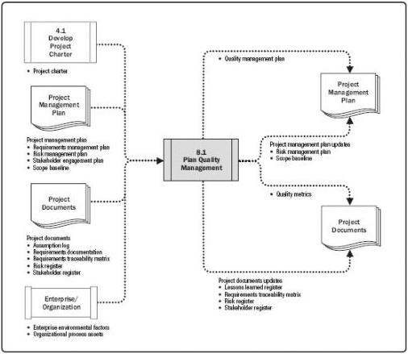

# Plan Quality Management

# Inputs

.1 Project charter
.2 Project management plan

- Requirements management plan
- Risk management plan
Stakeholder engagement plan
- Scope baseline

.3 Project documents

- Assumption log
- Requirements documentation
- Requirements traceability matrix
- Risk register
Stakeholder register

.4 Enterprise environmental factors
.5 Organizational process assets

# Tools & Techniques

.1 Expert judgment
.2 Data gathering

Benchmarking
- Brainstorming
- Interviews

.3 Data analysis

Cost-benefit analysis
Cost of quality

.4 Decision making

- Multicriteria decision analysis

.5 Data representation

- Flowcharts
- Logical data model
- Matrix diagrams
Mind mapping

.6 Test and inspection planning
.7 Meetings

# Outputs

.1 Quality management plan
.2 Quality metrics
.3 Project management plan updates

- Risk management plan
- Scope baseline

.4 Project documents updates

- Lessons learned register
- Requirements traceability matrix
- Risk register
Stakeholder register

Figure 8-3. Plan Quality Management: Inputs, Tools & Techniques, and Outputs

Figure 8-4. Plan Quality Management: Data Flow Diagram

285