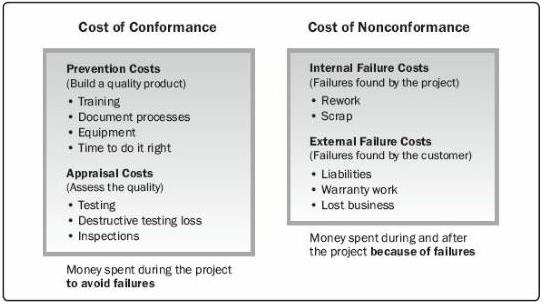

Figure 8-5. Cost of Quality

## 8.1.2.4 DECISION MAKING

A decision-making technique that can be used for this process includes but is not limited to multicriteria decision analysis. Multicriteria decision analysis tools (e.g., prioritization matrix) can be used to identify the key issues and suitable alternatives to be prioritized as a set of decisions for implementation. Criteria are prioritized and weighted before being applied to all available alternatives to obtain a mathematical score for each alternative. The alternatives are then ranked by score. As used in this process, it can help prioritize quality metrics.

## 8.1.2.5 DATA REPRESENTATION

Data representation techniques that can be used for this process include but are not limited to:

- Flowcharts. Flowcharts are also referred to as process maps because they display the sequence of steps and the branching possibilities that exist for a process that transforms one or more inputs into one or more outputs. Flowcharts show the activities, decision points, branching loops, parallel paths, and the overall order of processing by mapping the operational details of procedures that exist within a horizontal value chain. One version of a value chain, known as a SIPOC (suppliers, inputs, process, outputs, and customers) model, is shown in Figure 8-6. Flowcharts may prove useful in understanding and estimating the cost of quality for a process. Information is obtained by using the workflow branching logic and associated relative frequencies to estimate the expected monetary value for the conformance and

290