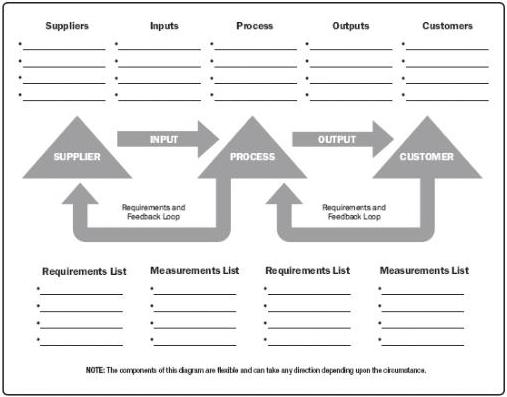

Figure 8-6. The SIPOC Model

## 8.1.2.6 TEST AND INSPECTION PLANNING

During the planning phase, the project manager and the project team determine how to test or inspect the product, deliverable, or service to meet the stakeholders' needs and expectations, as well as how to meet the goal for the product's performance and reliability. The tests and inspections are industry dependent and can include, for example, alpha and beta tests in software projects, strength tests in construction projects, inspection in manufacturing, and field tests and nondestructive tests in engineering.

## 8.1.2.7 MEETINGS

Project teams may hold planning meetings to develop the quality management plan. Attendees can include the project manager, the project sponsor, selected project team members, selected stakeholders, anyone with responsibility for project quality management activities, and others as needed.

## 8.1.3 PLAN QUALITY MANAGEMENT: OUTPUTS

### 8.1.3.1 QUALITY MANAGEMENT PLAN

292