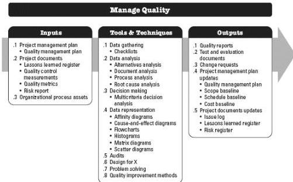
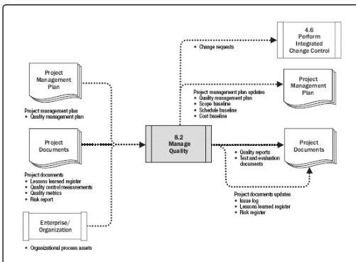

Figure 8-7. Manage Quality: Inputs, Tools & Techniques, and Outputs

Figure 8-8. Manage Quality: Data Flow Diagram

Manage Quality is sometimes called quality assurance, although Manage Quality has a broader definition than quality assurance as it is used in nonproject work. In project management, the focus of quality assurance is on the processes used in the project. Quality assurance is about using project processes effectively. It involves following and meeting

295