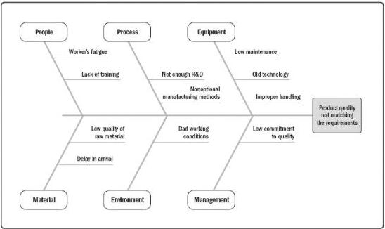

- Affinity diagrams. Described in Section 5.2.2.5. Affinity diagrams can organize potential causes of defects into groups showing areas that should be focused on the most.
- Cause-and-effect diagrams. Cause-and-effect diagrams are also known as fishbone diagrams, why-why diagrams, or Ishikawa diagrams. This type of diagram breaks down the causes of the problem statement identified into discrete branches, helping to identify the main or root cause of the problem. Figure 8-9 is an example of a cause-and-effect diagram.
- Flowcharts. Described in Section 8.1.2.5. Flowcharts show a series of steps that lead to a defect.
- Histograms. Histograms show a graphical representation of numerical data. Histograms can show the number of defects per deliverable, a ranking of the cause of defects, the number of times each process is noncompliant, or other representations of project or product defects.
- Matrix diagrams. Described in Section 8.1.2.5. The matrix diagram seeks to show the strength of relationships among factors, causes, and objectives that exist between the rows and columns that form the matrix.
- Scatter diagrams. A scatter diagram is a graph that shows the relationship between two variables. Scatter diagrams can demonstrate a relationship between any element of a process, environment, or activity on one axis and a quality defect on the other axis.

Figure 8-9. Cause-and-Effect Diagram

299