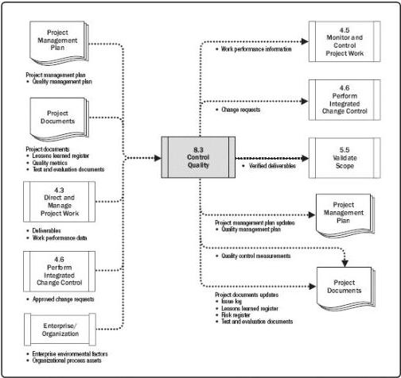

# Control Quality

## Inputs

.1 Project management plan
- Quality management plan
.2 Project documents
- Lessons learned register
- Quality metrics
- Test and evaluation documents
.3 Approved change requests
.4 Deliverables
.5 Work performance data
.6 Enterprise environmental factors
.7 Organizational process assets

## Tools & Techniques

.1 Data gathering
- Checklists
- Check sheets
- Statistical sampling
- Questionnaires and surveys
.2 Data analysis
- Performance reviews
- Root cause analysis
.3 Inspection
.4 Testing/product evaluations
.5 Data representation
- Cause-and-effect diagrams
Control charts
- Histogram
- Scatter diagrams
.6 Meetings

## Outputs

.1 Quality control measurements
.2 Verified deliverables
.3 Work performance information
.4 Change requests
.5 Project management plan updates
- Quality management plan
.6 Project documents updates
- Issue log
- Lessons learned register
- Risk register
- Test and evaluation documents

Figure 8-10. Control Quality: Inputs, Tools & Techniques, and Outputs

Figure 8-11. Control Quality: Data Flow Diagram

303