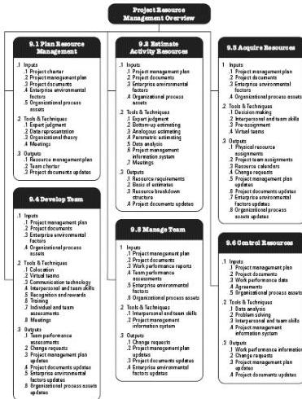

Figure 9-1. Project Resource Management Overview

There is a distinction between the skills and competencies needed for the project manager to manage team resources versus physical resources. Physical resources include equipment, materials, facilities, and infrastructure. Team resources or personnel refer to the human resources. Personnel may have varied skill sets, may be assigned full- or part-time, and may be added or removed from the project team as the project progresses. There is some overlap between Project Resource Management and Project Stakeholder Management (Section 13). This section (Section 9) focuses on the subset of stakeholders who make up the project team.

## KEY CONCEPTS FOR PROJECT RESOURCE MANAGEMENT

The project team consists of individuals with assigned roles and responsibilities who work collectively to achieve a shared project goal. The project manager should invest suitable effort in acquiring, managing, motivating, and empowering the project team. Although specific roles and responsibilities for the project team members are assigned, the involvement of all team members in project planning and decision making is beneficial.

311