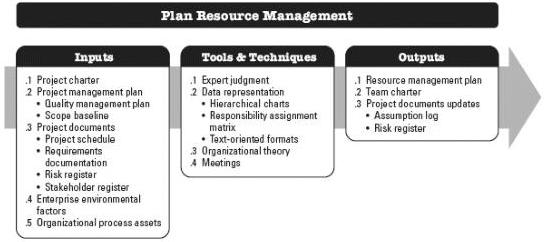
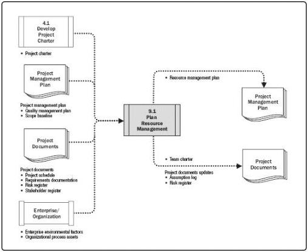

points in the project. The inputs, tools and techniques, and outputs of the process are depicted in Figure 9-2. Figure 9-3 depicts the data flow diagram for the process.

Figure 9-2. Plan Resource Management: Inputs, Tools & Techniques, and Outputs

Figure 9-3. Plan Resource Management: Data Flow Diagram

Resource planning is used to determine and identify an approach to ensure that sufficient resources are available for the successful completion of the project. Project

315