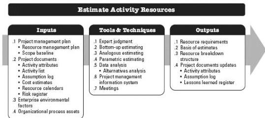

### 9.1.3.3 PROJECT DOCUMENTS UPDATES

Project documents that may be updated as a result of carrying out this process include but are not limited to:

- ◆ Assumption log. Described in Section 4.1.3.2. The assumption log is updated with assumptions regarding the availability, logistics requirements, and location of physical resources as well as the skill sets and availability of team resources.
- ◆ Risk register. Described in Section 11.2.3.1. The risk register is updated with risks associated with team and physical resource availability or other known resource-related risks.

## 9.2 ESTIMATE ACTIVITY RESOURCES

Estimate Activity Resources is the process of estimating team resources and the type and quantities of materials, equipment, and supplies necessary to perform project work. The key benefit of this process is that it identifies the type, quantity, and characteristics of resources required to complete the project. This process is performed periodically throughout the project as needed. The inputs, tools and techniques, and outputs of this process are depicted in Figure 9-5. Figure 9-6 depicts the data flow diagram of the process.

Figure 9-5. Estimate Activity Resources: Inputs, Tools & Techniques, and Outputs

322