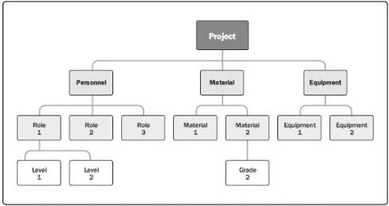

Figure 9-7. Sample Resource Breakdown Structure

### 9.2.3.4 PROJECT DOCUMENTS UPDATES

Project documents that may be updated as a result of carrying out this process include but are not limited to:

- Activity attributes. Described in Section 6.2.3.2. The activity attributes are updated with the resource requirements.
- Assumption log. Described in Section 4.1.3.2. The assumption log is updated with assumptions regarding the types and quantities of resources required. Additionally, any resource constraints are entered including collective bargaining agreements, continuous hours of operation, planned leave, etc.
- Lessons learned register. Described in Section 11.2.3.1. The lessons learned register can be updated with techniques that were efficient and effective in developing resource estimates, and information on those techniques that were not efficient or effective.

### 9.3 ACQUIRE RESOURCES

Acquire Resources is the process of obtaining team members, facilities, equipment, materials, supplies, and other resources necessary to complete project work. The key benefit of this process is that it outlines and guides the selection of resources and assigns them to their respective activities. This process is performed periodically throughout the project as needed. The inputs, tools and techniques, and outputs of the process are depicted in Figure 9-8. Figure 9-9 depicts the data flow diagram for the process.

328