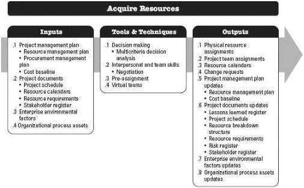
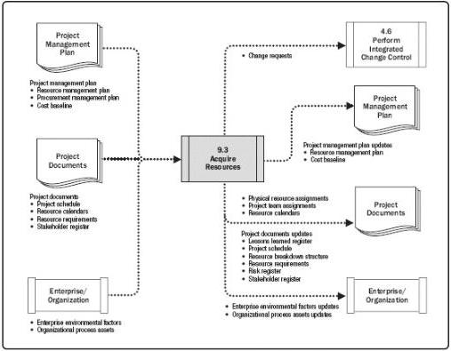

Figure 9-8. Acquire Resources: Inputs, Tools & Techniques, and Outputs

Figure 9-9. Acquire Resources: Data Flow Diagram

The resources needed for the project can be internal or external to the project-performing organization. Internal resources are acquired (assigned) from functional or resource managers. External resources are acquired through the procurement processes.

329