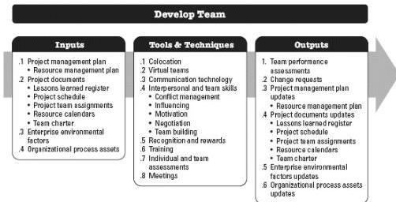

## 9.4 DEVELOP TEAM

Develop Team is the process of improving competencies, team member interaction, and the overall team environment to enhance project performance. The key benefit of this process is that it results in improved teamwork, enhanced interpersonal skills and competencies, motivated employees, reduced attrition, and improved overall project performance. This process is performed throughout the project.

The inputs, tools and techniques, and outputs of the process are depicted in Figure 9-10. Figure 9-11 depicts the data flow diagram for the process.

Figure 9-10. Develop Team: Inputs, Tools & Techniques, and Outputs

336