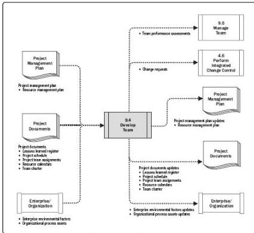

Figure 9-11. Develop Team: Data Flow Diagram

Project managers require the skills to identify, build, maintain, motivate, lead, and inspire project teams to achieve high team performance and to meet the project's objectives. Teamwork is a critical factor for project success, and developing effective project teams is one of the primary responsibilities of the project manager. Project managers should create an environment that facilitates teamwork and continually motivates the team by providing challenges and opportunities, providing timely feedback and support as needed, and recognizing and rewarding good performance. High team performance can be achieved by employing these behaviors:

- Using open and effective communication,
- Creating team-building opportunities,
- Developing trust among team members,
- Managing conflicts in a constructive manner,
- Encouraging collaborative problem solving, and
- Encouraging collaborative decision making.

Project managers operate in a global environment and work on projects characterized by cultural diversity. Team members often have diverse industry experience, communicate in multiple languages, and sometimes work with a "team language" or cultural norm that may be different from their native one. The project management team should capitalize on

337