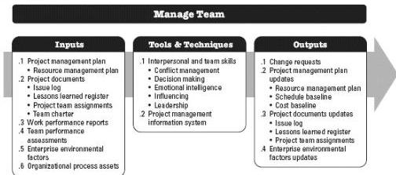

Manage Team is the process of tracking team member performance, providing feedback, resolving issues, and managing team changes to optimize project performance. The key benefit of this process is that it influences team behavior, manages conflict, and resolves issues. This process is performed throughout the project.

The inputs, tools and techniques, and outputs of the process are depicted in Figure 9-12. Figure 9-13 depicts the data flow diagram for the process.

Figure 9-12. Manage Team: Inputs, Tools & Techniques, and Outputs

345