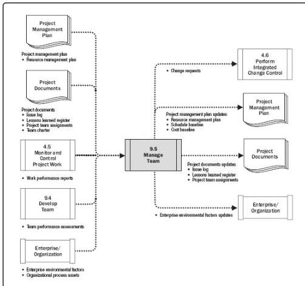

Figure 9-13. Manage Team: Data Flow Diagram

Managing the project team requires a variety of management and leadership skills for fostering teamwork and integrating the efforts of team members to create high-performance teams. Team management involves a combination of skills with special emphasis on communication, conflict management, negotiation, and leadership. Project managers should provide challenging assignments to team members and provide recognition for high performance.

The project manager needs to be sensitive to both the willingness and the ability of team members to perform their work and adjust their management and leadership styles accordingly. Team members with low-skill abilities will require more intensive oversight than those who have demonstrated ability and experience.

## 9.5.1 MANAGE TEAM: INPUTS

### 9.5.1.1 PROJECT MANAGEMENT PLAN

346