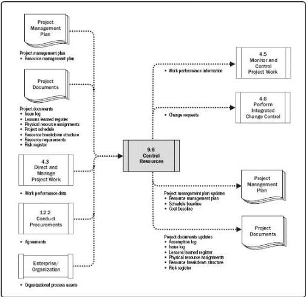

# Control Resources

## Inputs

.1 Project management plan
Resource management plan
.2 Project documents
- Issue log
- Lessons learned register
Physical resource assignments
Project schedule
Resource breakdown structure
Resource requirements
Risk register
.3 Work performance data
.4 Agreements
.5 Organizational process assets

## Tools & Techniques

.1 Data analysis
- Alternatives analysis
Cost-benefit analysis
Performance reviews
Trend analysis
.2 Problem solving
.3 Interpersonal and team skills
Negotiation
Influencing
.4 Project management information system

## Outputs

.1 Work performance information
.2 Change requests
.3 Project management plan updates

Resource management plan
Schedule baseline
Cost baseline

.4 Project documents updates

Assumption log
- Issue log
- Lessons learned register
Physical resource assignments
Resource breakdown structure
Risk register

Figure 9-14. Control Resources: Inputs, Tools & Techniques, and Outputs

Figure 9-15. Control Resources: Data Flow Diagram

352