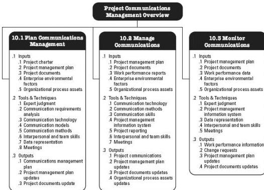

Figure 10-1. Project Communications Overview

# KEY CONCEPTS FOR PROJECT COMMUNICATIONS MANAGEMENT

Communication is the exchange of information, intended or involuntary. The information exchanged can be in the form of ideas, instructions, or emotions. The mechanisms by which information is exchanged can be in:

- ◆ Written form. Either physical or electronic.
- ◆ Spoken. Either face-to-face or remote.
- ◆ Formal or informal (as in formal papers or social media).
- ◆ Through gestures. Tone of voice and facial expressions.
- ◆ Through media. Pictures, actions, or even just the choice of words.
- ◆ Choice of words. There is often more than one word to express an idea; there can be subtle differences in the meaning of each of these words and phrases.

Communications describe the possible means by which the information can be sent or received, either through communication activities, such as meetings and presentations, or artifacts, such as emails, social media, project reports, or project documentation.

Project managers spend most of their time communicating with team members and other project stakeholders, both internal (at all organizational levels) and external to the organization. Effective communication builds a bridge between diverse stakeholders who

359